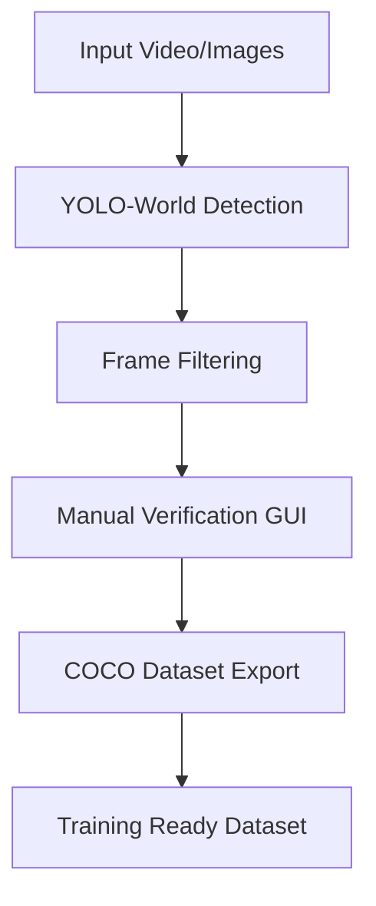

# AutoLabeller

[](https://opensource.org/licenses/MIT)


An intelligent dataset labeling tool combining YOLO-World's open-set detection capabilities with human verification, optimized for quickly creating high-quality COCO-format datasets.


## Features

- **YOLO-World Integration**: Leverage state-of-the-art open-set object detection
- **Smart Frame Selection**: Avoid redundant frames using detection-based similarity checks
- **Interactive GUI**:
  - Real-time bounding box editing
  - Class cycling with single click
  - Drag-to-draw missing detections
  - Dynamic confidence threshold adjustment
- **COCO Dataset Export**: Industry-standard output format
- **Performance Optimizations**:
  - GPU-accelerated inference
  - Multi-threaded processing
  - Intelligent frame caching

## Pipeline Overview




## Inspiration

This project was born from the need to:
1. Reduce manual labeling effort in custom detection projects
2. Create a middle-ground between fully automatic and manual labeling
3. Leverage YOLO-World's exceptional open-vocabulary capabilities
4. Provide a standardized COCO-format output for compatibility with modern ML frameworks

## Installation

### Requirements
- Python 3.8+
- NVIDIA GPU (recommended)
- CUDA 11.8
- cuDNN 8.6+

### From Source
```
git clone https://github.com/sah4jpatel/AutoLabeller.git
cd AutoLabeller
pip install -e .
```

## Usage

### Basic Command
```
autolabel
--input path/to/input
--classes "class1" "class2" ...
--model path/to/model.pt
--output dataset.json
```

### Full Options
```
autolabel
--input path/to/video_or_directory
--classes class1 class2 class3
--model custom_yoloworld.pt
--output my_dataset.json
--conf_thresh 0.15
--full_video
--min_images 1000
```

| Flag | Description | Default |
|------|-------------|---------|
| `--input` | Video file or image directory | Required |
| `--classes` | Space-separated list of classes | Required |
| `--model` | YOLO-World model path | Required |
| `--output` | Output COCO JSON path | dataset.json |
| `--conf_thresh` | Detection confidence threshold | 0.25 |
| `--full_video` | Disable frame filtering | False |
| `--min_images` | Minimum output images | 0 |

## Training Custom YOLO-World Models

1. Prepare dataset in COCO format
2. Create model config (`custom.yaml`):
```
path: datasets/custom
train: images/train
val: images/val
names:
    0: class1
    1: class2
```

3. Start training:
```
yolo detect train data=custom.yaml model=yolow_world.pt epochs=100 imgsz=640 device=0
```

Full training documentation: [Ultralytics YOLO-World Docs](https://docs.ultralytics.com/models/yolo-world/)

## Troubleshooting

**Q:** Getting `ModuleNotFoundError: No module named 'autolabeller'`  
**A:** Ensure proper installation using `pip install -e .` from project root

**Q:** GUI window scaling issues  
**A:** Install screeninfo package: `pip install screeninfo`

**Q:** CUDA out of memory errors  
**A:** Reduce batch size in detection parameters or use smaller model variant

## License

MIT License - see [LICENSE](LICENSE) for details

---